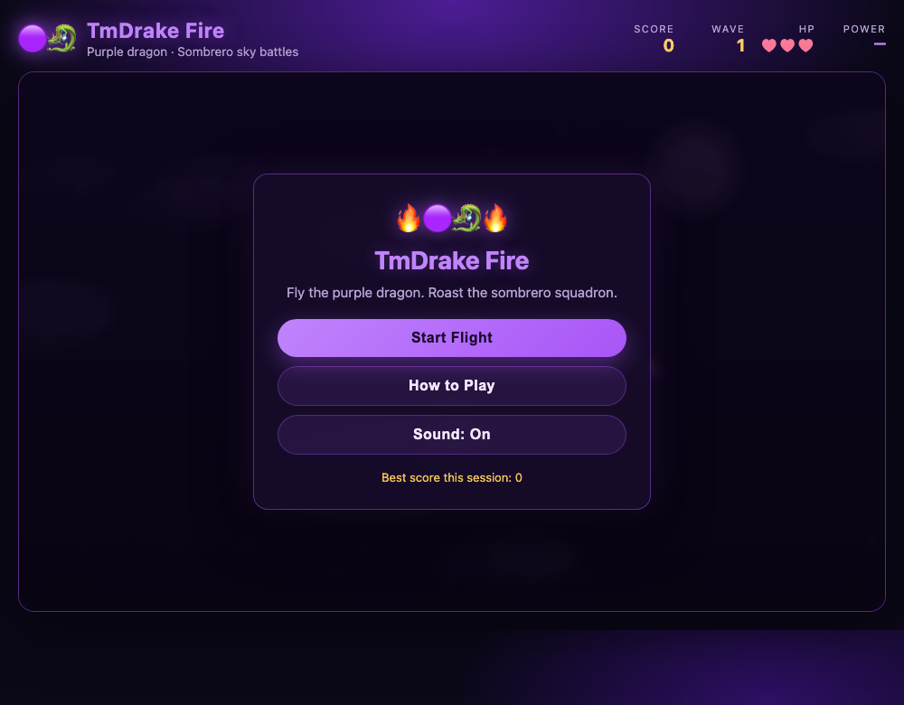
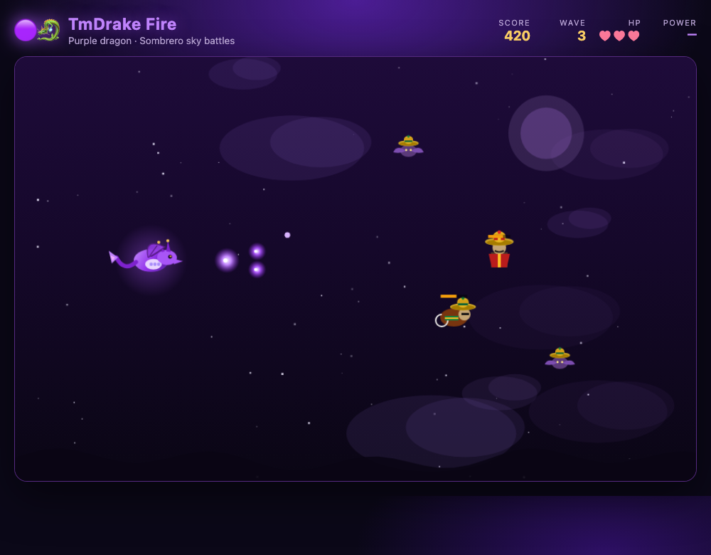
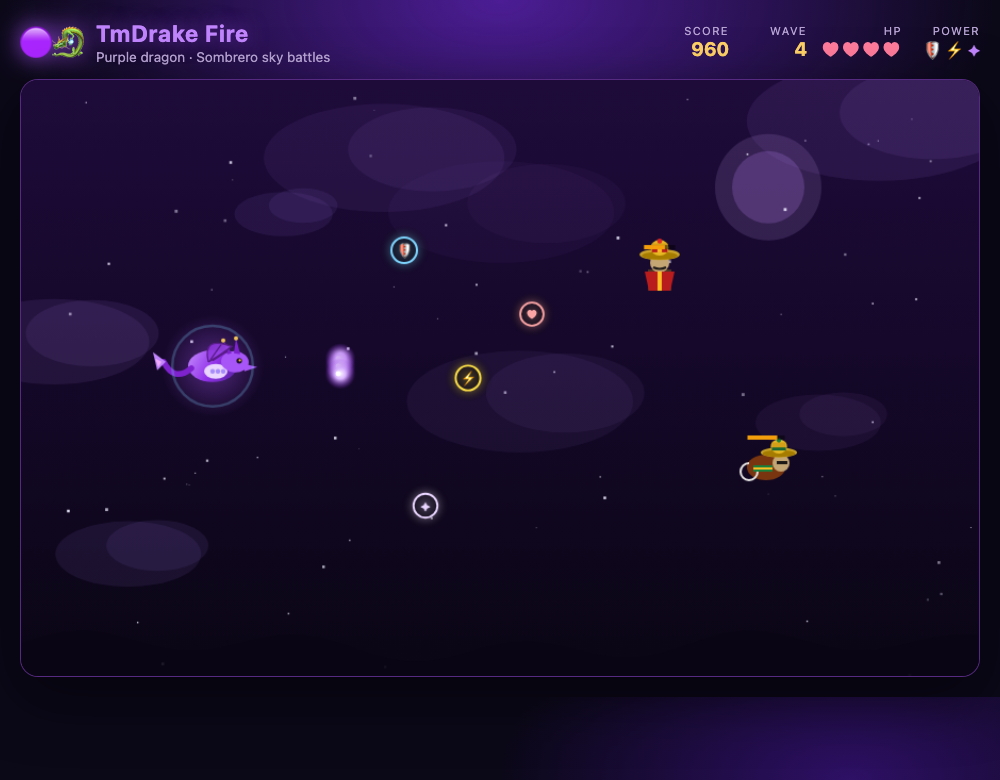
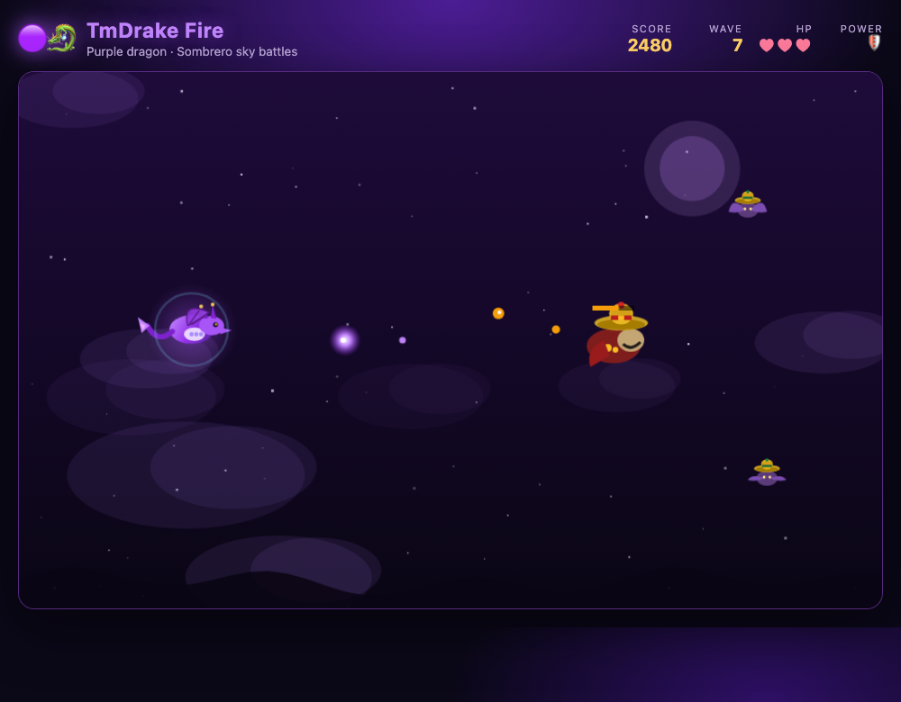

# TmDrake Fire 🟣🐉

A small browser shooter starring a **purple tmdrake-style dragon** vs a **sombrero squadron**.

Built as a first Mac game project — pure HTML / CSS / JavaScript. No install required.

## Play

**Online:** [tmdrake.github.io/TmDrake-Fire](https://tmdrake.github.io/TmDrake-Fire/)

**Local:** open `index.html` in Safari or Chrome:

```bash
open index.html
```

## Screenshots

### Main menu


### Gameplay — sombrero squadron


### Power-ups


### Boss — El Jefe


## Controls

| Action | Keys |
|--------|------|
| Move | WASD / Arrow keys |
| Shoot | Space / Click (hold OK) |
| Pause | P |
| Mute | M |
| Restart (game over) | R |

## Features

- Purple **tmdrake** dragon with gold-tipped horns and purple fire
- Enemies: **Mariachi**, **Bandito**, **Vaquero**, **El Jefe** (all with sombreros)
- Power-ups: Shield, Rapid Fire, Triple Shot, Heart
- Wave-based scoring + session best score
- Web Audio sound effects (no asset files)
- Main menu, how-to-play, pause, game over

## Project layout

```
index.html          # shell + menus
style.css           # purple theme UI
game.js             # game loop, entities, audio, drawing
screenshots/        # repo promo shots
```

## Recapture screenshots

With Google Chrome installed:

```bash
mkdir -p screenshots
CHROME="/Applications/Google Chrome.app/Contents/MacOS/Google Chrome"
BASE="file://$(pwd)/index.html"
for shot in menu play power boss; do
  "$CHROME" --headless=new --disable-gpu --hide-scrollbars \
    --window-size=1000,780 --virtual-time-budget=3000 \
    --screenshot="screenshots/${shot}.png" "${BASE}?shot=${shot}"
done
```

## License

MIT — made for fun by tmdrake.
